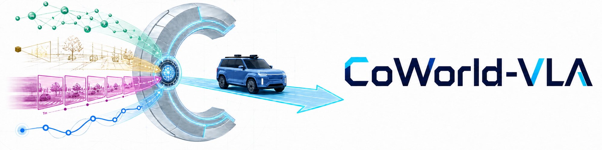

<div align="center">



<h1>CoWorld-VLA: Thinking in a Multi-Expert World Model for Autonomous Driving</h1>

<strong>Minqing Huang<sup>1*</sup>, Yujiao Xiang<sup>1,2*</sup>, Zihan Liang<sup>1,3*</sup>, Jiajie Huang<sup>1,4*</sup>, Jingqi Wang<sup>1*,†</sup></strong>

<strong>Yuheng Zhou<sup>1,5</sup>, Zhi Xu<sup>1</sup>, Feiyang Tan<sup>1</sup>, Hangning Zhou<sup>1</sup>, Mu Yang<sup>1</sup>, Gong Chen<sup>1,6</sup></strong>

<sup>1</sup> [Afari Intelligent Drive](https://afari.com/) &nbsp;&nbsp; <sup>2</sup> [UESTC](https://en.uestc.edu.cn/ "University of Electronic Science and Technology of China") &nbsp;&nbsp; <sup>3</sup> [SJTU](https://en.sjtu.edu.cn/ "Shanghai Jiao Tong University") &nbsp;&nbsp; <sup>4</sup> [BUPT](https://english.bupt.edu.cn/ "Beijing University of Posts and Telecommunications") &nbsp;&nbsp; <sup>5</sup> [SEU](https://www.seu.edu.cn/english/ "Southeast University") &nbsp;&nbsp; <sup>6</sup> [TJU](https://en.tju.edu.cn/ "Tianjin University")

*Equal contribution. Listed in no particular order. † Corresponding author: wangjingqi02@qianli-drive.com

[](https://arxiv.org/abs/2605.10426)
[](https://huggingface.co/hmq1211/CoWorld-VLA)
[](https://arxiv.org/abs/2605.10426)
[](https://arxiv.org/abs/2605.10426)

</div>

## News

- `[2026/05/19]` The CoWorld-VLA checkpoint was released on [Hugging Face](https://huggingface.co/hmq1211/CoWorld-VLA).
- `[2026/05/18]` The VLM feature cache builder was released.
- `[2026/05/14]` The CoWorld-VLA inference code was released.

## Overview

CoWorld-VLA is a multi-expert world reasoning framework for end-to-end autonomous driving. It distills complementary world information into four types of planner-accessible expert tokens:

- **Semantic interaction tokens** capture interaction intent.
- **Geometric structure tokens** represent spatial scene structure.
- **Dynamic evolution tokens** model future temporal dynamics.
- **Ego trajectory tokens** encode behavioral goals.

A diffusion-based hierarchical multi-expert fusion planner combines these representations with scene context to generate continuous future trajectories. Under the single-frame, camera-only setting, CoWorld-VLA achieves **90.0 PDMS on NAVSIM v1** and **90.0 EPDMS on NAVSIM v2**.

<div align="center">
  <a href="assets/overview3.png">
    
  </a>
  <p><strong>CoWorld-VLA overview.</strong> The framework learns action-conditioned predictive world dynamics, distills multi-expert representations into the VLA token space, and fuses them for trajectory generation.</p>
</div>

## Visualization

<div align="center">
  <a href="assets/future-scene-generation.png">
    
  </a>
  <p><strong>Qualitative results of future scene generation.</strong> From top to bottom: ground truth, Stage 1 predictions, and Stage 2 predictions. Stage 2 more faithfully preserves the intended turning direction and lane-level scene evolution, producing future frames that better align with the ground truth.</p>
</div>

## Getting Started

- [Installation, model preparation, and NAVSIM evaluation](docs/installation.md)

The current release includes inference code, the VLM feature cache builder, the CoWorld-VLA checkpoint, and NAVSIM PDM evaluation. The default configuration is [`configs/coworld_inference.yaml`](configs/coworld_inference.yaml). Training code will be released later.

## Model Zoo

| Model | Input | NAVSIM v1 PDMS | NAVSIM v2 EPDMS | Weights |
| --- | --- | ---: | ---: | --- |
| CoWorld-VLA | 1 frame, camera only | **90.0** | **90.0** | [Hugging Face](https://huggingface.co/hmq1211/CoWorld-VLA) |

## Citation

```bibtex
@article{huang2026coworld,
  title={CoWorld-VLA: Thinking in a Multi-Expert World Model for Autonomous Driving},
  author={Huang, Minqing and Xiang, Yujiao and Liang, Zihan and Huang, Jiajie and Wang, Jingqi and Zhou, Yuheng and Xu, Zhi and Tan, Feiyang and Zhou, Hangning and Yang, Mu and Chen, Gong},
  journal={arXiv preprint arXiv:2605.10426},
  year={2026}
}
```

## Acknowledgements

CoWorld-VLA uses [NAVSIM](https://github.com/autonomousvision/navsim) for PDM evaluation and builds on the nuPlan ecosystem used by NAVSIM. It also uses pretrained [V-JEPA](https://ai.meta.com/vjepa/) / V-JEPA 2 representations and [VGGT](https://vgg-t.github.io/) for dynamic and geometric world context. We thank the contributors of these projects for their open-source efforts.
