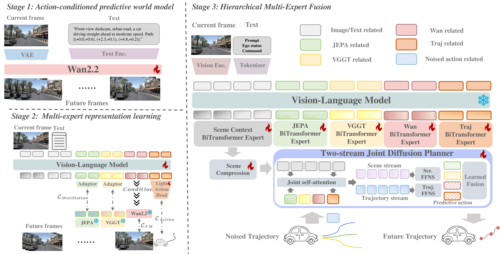

<div align="center">

<h1 align="center">CoWorld-VLA: Thinking in a Multi-Expert World Model for Autonomous Driving</h1>

<strong>Minqing Huang<sup>1*</sup>, Yujiao Xiang<sup>1,2*</sup>, Zihan Liang<sup>1,3*</sup>, Jiajie Huang<sup>1,4*</sup>, Jingqi Wang<sup>1*,†</sup>

<strong>Zhi Xu<sup>1</sup>, Feiyang Tan<sup>1</sup>, Hangning Zhou<sup>1</sup>, Mu Yang<sup>1</sup>, Gong Chen<sup>1,5</sup></strong>

<sup>1</sup> Afari Intelligent Drive, <sup>2</sup> University of Electronic Science and Technology of China

<sup>3</sup> Shanghai Jiao Tong University, <sup>4</sup> Beijing University Of Posts and Telecommunications, <sup>5</sup> Tianjin University

(*) The authors contributed equally and are listed in no particular order. (†) Corresponding author: wangjingqi02@qianli-drive.com

</div>

## Abstract

Vision-Language-Action (VLA) models have emerged as a promising paradigm for end-to-end autonomous driving. However, existing reasoning mechanisms still struggle to provide planning-oriented intermediate representations: textual Chain-of-Thought (CoT) fails to preserve continuous spatiotemporal structure, while latent world reasoning remains difficult to use as a direct condition for action generation. In this paper, we propose CoWorld-VLA, a multi-expert world reasoning framework for autonomous driving, where world representations serve as explicit conditions to guide action planning. CoWorld-VLA extracts complementary world information through multi-source supervision and encodes it into expert tokens within the VLA, thereby providing planner-accessible conditioning signals. Specifically, we construct four types of tokens: semantic interaction, geometric structure, dynamic evolution, and ego trajectory tokens, which respectively model interaction intent, spatial structure, future temporal dynamics, and behavioral goals. During action generation, CoWorld-VLA employs a diffusion-based hierarchical multi-expert fusion planner, which is coupled with scene context throughout the joint denoising process to generate continuous ego trajectories. Experiments show that CoWorld-VLA achieves competitive results in both future scene generation and planning on the NAVSIM v1 benchmark, demonstrating strong performance in collision avoidance and trajectory accuracy. Ablation studies further validate the complementarity of expert tokens and their effectiveness as planning conditions for action generation.

## Overview

<div align="center">
  
  <br>
  <div style="color: #555; width: 900px; text-align: left;">
    <p><strong>Overview of CoWorld-VLA.</strong> The framework first learns action-conditioned predictive world dynamics, then distills complementary multi-expert representations into VLA token space. At inference time, semantic interaction, geometric structure, dynamic evolution, and ego trajectory tokens are fused by a hierarchical multi-expert diffusion planner to generate continuous future trajectories.</p>
  </div>
</div>

## Release Status

- [x] CoWorld-VLA inference code. Released on 2026-05-14.
- [x] VLM feature cache builder. Released on 2026-05-18.
- [x] CoWorld-VLA checkpoint. Released on 2026-05-19.
- [ ] CoWorld-VLA Training code. Coming later.

This branch ships inference + NAVSIM PDM evaluation only; the default config is `configs/coworld_inference.yaml`. Training code will be released later.

## Model Zoo

Model weights are hosted on Hugging Face.

| Component | Hugging Face repo | Notes |
| --- | --- | --- |
| CoWorld-VLA checkpoint | [hmq1211/CoWorld-VLA](https://huggingface.co/hmq1211/CoWorld-VLA) | Set `COWORLD_CHECKPOINT` to the downloaded checkpoint directory or `.pt` file. |

Download the checkpoint with:

```bash
pip install -U huggingface_hub
huggingface-cli download hmq1211/CoWorld-VLA \
  --local-dir /path/to/CoWorld-VLA \
  --local-dir-use-symlinks False
```

If the Hugging Face repository is private, run `huggingface-cli login` first with an account that has access.

## Setup

```bash
conda create -n coworld python=3.10 -y
conda activate coworld
pip install -e .
pip install -r requirements.txt
```

Install NAVSIM v1.1 and nuPlan devkit in the same environment. Then prepare the NAVSIM metric cache once:

```bash
python navsim/planning/script/run_metric_caching.py \
  train_test_split=navtest \
  cache.cache_path="$NAVSIM_EXP_ROOT/metric_cache"
```

Required environment variables:

```bash
export NAVSIM_DEVKIT_ROOT=/path/to/navsim
export OPENSCENE_DATA_ROOT=/path/to/openscene-v1.1
export NAVSIM_EXP_ROOT=/path/to/navsim/exp

export COWORLD_VLM_MODEL_PATH=/path/to/Qwen3-VL-2B-Instruct
export COWORLD_VGGT_MODEL_PATH=/path/to/vggt
export COWORLD_VJEPA_CKPT=/path/to/vjepa2_1_vitG_384.pt
export COWORLD_CHECKPOINT=/path/to/CoWorld-VLA/checkpoints
```

`COWORLD_CHECKPOINT` may point either to a checkpoint directory containing `model_state_dict.pt`, or to a single `.pt` state dict; the cache builder and evaluator both consume it. `COWORLD_VGGT_MODEL_PATH` should point to the pretrained VGGT weights (or a local Hugging Face directory) — the VGGT source itself is vendored under `models/vggt/`.

## VLM Feature Cache

CoWorld-VLA can run with a precomputed VLM feature cache (recommended for repeated NAVSIM runs) or by running the VLM online during evaluation (simpler but slower and heavier on GPU memory). The evaluation wrapper picks the cache automatically when one exists at:

```text
artifacts/vlm_feature_cache/
```

Override the location with:

```bash
export COWORLD_VLM_FEATURE_CACHE_DIR=/path/to/coworld_vlm_feature_cache
```

To build the cache first, run:

```bash
NPROC_PER_NODE=8 ./scripts/evaluation/build_coworld_vlm_cache.sh \
  --config configs/coworld_inference.yaml \
  --checkpoint "$COWORLD_CHECKPOINT" \
  --output-dir "$COWORLD_VLM_FEATURE_CACHE_DIR"
```

The builder writes:

```text
$COWORLD_VLM_FEATURE_CACHE_DIR/val/
  hidden_*.bin
  tensors_*.safetensors
  info_*.json
```

It uses the NAVSIM defaults from `OPENSCENE_DATA_ROOT` and `NAVSIM_DEVKIT_ROOT`. You can pass the same data overrides as evaluation:

```bash
./scripts/evaluation/build_coworld_vlm_cache.sh \
  --checkpoint "$COWORLD_CHECKPOINT" \
  --output-dir "$COWORLD_VLM_FEATURE_CACHE_DIR" \
  --navsim-log-path /path/to/navsim_logs/test \
  --sensor-blobs-path /path/to/sensor_blobs/test \
  --scene-filter-yaml /path/to/navtest.yaml
```

The VLM feature cache is checkpoint-specific; rebuild it if you change the Qwen model, tokenizer, action-token layout, or CoWorld checkpoint.

## Run PDM Evaluation

Recommended: build the cache if needed, then run PDM evaluation:

```bash
NPROC_PER_NODE=8 ./scripts/evaluation/run_coworld_navsim_pdm.sh --build-cache-first
```

Single machine, all visible GPUs:

```bash
./scripts/evaluation/run_coworld_navsim_pdm.sh
```

Single machine, specific GPU count:

```bash
NPROC_PER_NODE=4 ./scripts/evaluation/run_coworld_navsim_pdm.sh
```

Quick sanity check on a small subset:

```bash
NPROC_PER_NODE=1 ./scripts/evaluation/run_coworld_navsim_pdm.sh --max-scenes 32
```

Direct mode without a VLM cache:

```bash
NPROC_PER_NODE=1 ./scripts/evaluation/run_coworld_navsim_pdm.sh --no-vlm-cache --max-scenes 32
```

Custom output directory:

```bash
COWORLD_OUTPUT_DIR=/tmp/coworld_pdm_eval \
./scripts/evaluation/run_coworld_navsim_pdm.sh
```

The wrapper expands to:

```bash
./scripts/evaluation/run_eval_navsim_pdm_multigpu.sh \
  --config configs/coworld_inference.yaml \
  --checkpoint "$COWORLD_CHECKPOINT" \
  --vlm-feature-cache-dir "${COWORLD_VLM_FEATURE_CACHE_DIR:-artifacts/vlm_feature_cache}" \
  --output-dir "${COWORLD_OUTPUT_DIR:-outputs/coworld_pdm_eval}"
```

If no cache is found and no cache mode is forced, `run_coworld_navsim_pdm.sh` falls back to direct VLM forward automatically. To require cached mode, set:

```bash
export COWORLD_USE_VLM_CACHE=1
```

`run_eval_navsim_pdm_multigpu.sh` auto-derives the NAVSIM log/sensor/metric-cache/scene-filter paths from `OPENSCENE_DATA_ROOT`, `NAVSIM_EXP_ROOT`, and `NAVSIM_DEVKIT_ROOT`. Override any of them by passing explicit arguments:

```bash
./scripts/evaluation/run_coworld_navsim_pdm.sh \
  --navsim-log-path /path/to/navsim_logs/test \
  --sensor-blobs-path /path/to/sensor_blobs/test \
  --metric-cache-path /path/to/metric_cache \
  --scene-filter-yaml /path/to/navtest.yaml
```

## Outputs

Each evaluation run writes to:

```text
<output_root>/<timestamp>/
```

Expected files:

```text
pdm_results_chunk0.json
pdm_results_chunk1.json
...
pdm_merged_aggregate.json
```

The merged aggregate reports mean NAVSIM PDM score and component metrics over valid scenes.

If you need to merge existing chunks again:

```bash
python scripts/evaluation/merge_pdm_eval_chunks.py /path/to/output/<timestamp>
```

## Acknowledgements

This repository builds on ideas and code from the autonomous driving, world modeling, and vision-language-action community. In particular, CoWorld-VLA uses [NAVSIM](https://github.com/autonomousvision/navsim) for PDM evaluation, relies on the nuPlan ecosystem used by NAVSIM, and uses pretrained [V-JEPA](https://ai.meta.com/vjepa/) / V-JEPA2-style representations and [VGGT](https://vgg-t.github.io/) for dynamic and geometric world context. We thank the contributors of these projects for their open-source efforts.

## Citation

```bibtex
@article{huang2026coworld,
  title={CoWorld-VLA: Thinking in a Multi-Expert World Model for Autonomous Driving},
  author={Huang, Minqing and Xiang, Yujiao and Liang, Zihan and Huang, Jiajie and Wang, Jingqi and Xu, Zhi and Tan, Feiyang and Zhou, Hangning and Yang, Mu and Che, Gong},
  journal={arXiv preprint arXiv:2605.10426},
  year={2026}
}
```

If you use this repository, please also cite the upstream projects below:

```bibtex
@inproceedings{dauner2024navsim,
  title={NAVSIM: Data-Driven Non-Reactive Autonomous Vehicle Simulation and Benchmarking},
  author={Dauner, Daniel and Hallgarten, Marcel and Li, Tianyu and Weng, Xinshuo and Huang, Zhiyu and Yang, Zetong and Li, Hongyang and Gilitschenski, Igor and Ivanovic, Boris and Pavone, Marco and Geiger, Andreas and Chitta, Kashyap},
  booktitle={Advances in Neural Information Processing Systems},
  year={2024}
}

@article{caesar2021nuplan,
  title={nuPlan: A closed-loop ML-based planning benchmark for autonomous vehicles},
  author={Caesar, Holger and Kabzan, Juraj and Tan, Kok Seang and Fong, Whye Kit and Wolff, Eric M. and Lang, Alex and Fletcher, Luke and Beijbom, Oscar and Omari, Sammy},
  journal={arXiv preprint arXiv:2106.11810},
  year={2021}
}

@article{assran2025vjepa2,
  title={V-JEPA 2: Self-Supervised Video Models Enable Understanding, Prediction and Planning},
  author={Assran, Mido and Bardes, Adrien and Fan, David and Garrido, Quentin and Howes, Russell and Komeili, Mojtaba and Muckley, Matthew and Rizvi, Ammar and Roberts, Claire and Sinha, Koustuv and others},
  journal={arXiv preprint arXiv:2506.09985},
  year={2025}
}

@inproceedings{wang2025vggt,
  title={VGGT: Visual Geometry Grounded Transformer},
  author={Wang, Jianyuan and Chen, Minghao and Karaev, Nikita and Vedaldi, Andrea and Rupprecht, Christian and Novotny, David},
  booktitle={Proceedings of the IEEE/CVF Conference on Computer Vision and Pattern Recognition},
  year={2025}
}
```

## Notes

- The default planner predicts 8 future waypoints at 2 Hz.
